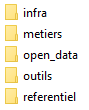
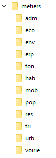
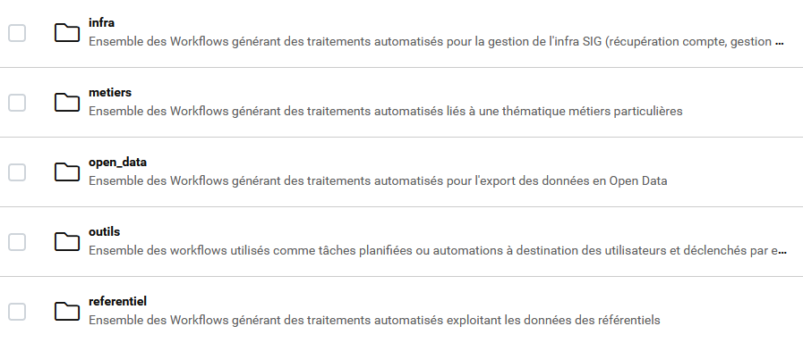
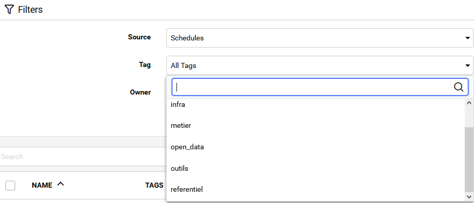

# Principes organisationnels du Service Information Géographique de l'Agglomération de la Région de Compiègne

* [Organisation de la base de données `igeo_compiegnois`](#la-base-de-données-igeo_compiegnois)
* [Organisation du répertoire lié aux procédures partagées FMEForm et FMFlow](#organisation-du-répertoire-lié-aux-procédures-partagées-fmeform-et-fmflow)

# La base de données `igeo_compiegnois`

- Script générique (trigger, ...) contenu dans la base et mutualisé à l'ensemble des données
  * [script générique](sql/igeo_public.sql) (à faire)

## Les rôles de connexion et privilèges des groupes
  
  * **Généralité** :
  
L'ensemble des paramètres de connexion sont disponibles sur le wiki dédié "Serveur de base de données" sur le serveur RedMine.
  
La propriété des schémas, tables, ... a été transféré au groupe create_sig pour qu'il puisse modifier la structure. Les autres groupes ne pourront pas le faire. Le rôle postgres reste le superutilisateur et peut modifier la structure même si il n'est pas le propriétaire. 

**ATTENTION :** petite particularité importante, le rafraichissement des données d’une vue matérialisée peut se produire uniquement avec ce rôle de connexion.

Le groupe edit_sig ne peut que modifier les données. Il ne peut pas modifier la structure, faire de trigger, ni de clés, ni tronquer les tables.
Le groupe read_sig peut uniquement lire les données.

Des particularités ont été intégrés concernant les privilèges sur certains schémas. En effet, il n’est pas nécessaire que le rôle edit_sig puisse modifier les données sur les schémas contenant des référentiels extérieurs. Sur ceux-ci le rôle edit_sig a seulement un rôle de lecture.
  
  * **Tableaux de répartition** :

|Rôle de connexion|Superutilisateur|Utilisateur|Propriétaire des objets|Appartient au groupe|Privilèges sur la structure|Privilèges sur les données|
|:-:|:-:|:-:|:-:|:-:|:-:|:-:|
||x|postgres|(par défaut)|-|all|all|
|create_sig|||x|-|-|-|
|||sig_create||create_sig|all|all|
|||sig_edit||create_sig|aucun|select,insert,update,delete|
|||sig_read||create_sig|aucun|select|

## Règles de dénomination des objets de la base de données

L'ensemble des libellés (schéma, table, champ, vue, ...) doit être écrit en minuscule ce qui permet d'éviter l’utilisation des "" dans les requêtes sql).

## Commentaires sur les objets

L'ensemble des objets (schéma, table, attribut, vue, trigger, ...) contenu dans la base de données doit être commenté comme suit :
- un schéma : description succinte du contenu et de l'usage générique des données
- une table : description succinte du contenu, de l'usage et des particularités si besoin
- un attribut : libellé complet et description succinte si besoin
- une séquence : description de l'usage, de la table et de l'attribut cible
- un trigger / une fonction / une règle : description succinte de son fonctionnement
- une vue : description succinte de son contenu et de son usage

Les contraintes sur les attributs ainsi que les indexes n'ont pas d'obligation de commentaires.

Exemple :

|Objet|Intitulé|Exemple de commentaires |
|:-:|:-:|:-:|
|schéma|`m_defense_incendie`|Données géographiques métiers sur le théme des Points d'Eau Incendie permettant de définir la conformité par rapport à la défense contre les incendies|
|table|`geo_pei`|Classe décrivant un point d'eau incendie|
|attribut|`raccord`|Descriptif des raccords de sortie du PEI (nombre et diamètres exprimés en mm)|
|vue|`geo_v_pei_ctr`|Vue éditable destinée à la modification des données relatives aux PEI et aux contrôles|
|trigger|`t_t1_geo_v_pei_ctr`|Trigger de vue s'exécutant pour une instance d'insertion, de mise à jour ou de suppression |
|fonction |`ft_m_geo_v_pei_ctr`|Fonction métier liée au trigger `t_t1_geo_v_pei_ctr`, gérant les particularités liées à la gestion des données en cas d'insertion, de mise à jour ou de suppression|
|séquence |`geo_pei_id_seq`|Séquence dépendante à la table `geo_pei` pour l'attribut `id_pei`|

**ATTENTION : pour les fonctions liées à un trigger, il est impératif de commenter le développement effectué à l'intérieur du code SQL afin de comprendre les différentes étapes ou particularités.**

### Les schémas

  * **Généralité** :
  
Un schéma doit contenir uniquement de la donnée brute qui peut être modifiée soit manuellement ou avec l'aide de déclencheur (ou trigger) mis en place pour automatiser certaines tâches.
Seules les vues pour la gestion ou de filtrage simplifié de la donnée peuvent être contenues dans les schémas de gestion. Les autres vues ayant des usages décisionnels, d'analyses ou d'OpenData sont stockées dans le schémas d'exploitation. Cette dernière recommandation est en cours de modification. Les vues applicatives et d'OpenData directement liées à la source métier seront stcokées dans le schéma métier et non plus dans les schémas dédiés.

Tableau listant les schémas internes de gestions ou applicatifs (hors métiers).

|Nom du schéma|Description|
|:-:|:-:|
|public|Schéma public standard à Postgres. Ce schéma ne contient aucune classe d'objets. Il contient uniquement des fonctions génériques. Ces fonctions sont à recréer en cas de migration vers une nouvelle version de Postgres (cf partie restauration|
|x_admin|Schéma contenant les classes d'objets servant à l'adminsitration générale de la base de données (modèle, liste des vues, tables, dépendances, ....)|
|x_apps|Schéma contenant les classes d'objets applicatives multi-thématique. Les classes d'objets applicatives métiers sont stockés dans les schémas métiers|
|x_apps_public|Schéma contenant les classes d'objets servant à une diffusion dans des applications Grand Public (ce schéma est voué à disparaître |
|x_opendata|Schéma contenant les données formatées à des standards OpenData (ce schéma est voué à disparaître au profit d'une ventilation des formats OpenData dans les schémas métiers)|
|x_outils|Schéma contenant les classes d'objets utilisés dans les automatismes mis en oeuvre pour les utilisateurs (extracteur, boitage, ...)|
|x_projet|Schéma temporaire stockant des données provisoires ou de tests utilisés dans des applications ou des traitements nécessitant leurs intégrations dans la base de données|

   * **Tableaux de nomage** :

4 types de préfixes de dénomination de schémas sont présents dans la base de données :

|Préfixe|Nom du schéma|Type|Exemple|Définition|
|:-:|:-:|:-:|:-:|:-:|
|m_|nom de la thématique|gestion|m_urbanisme_doc, m_habitat, ...|contient des données métiers gérés par l'Agglomération ou utilisées pour les besoins d'un service|
|r_|nom du référentiel|gestion|r_bdtopo, r_pcrs, r_objet,...|contient des données issues de référentiel ou étant concédéré comme des référenties gérées par l'Agglomération ou provenant de producteurs tiers |
|s_|nom de la base de données|gestion|s_sirene, s_rpls, ...|contient des données attributaires de référence provenant de producteurs tiers|
|x_|nom de l'usage|exploitation||contient des données pré-traitées pour les applications Grands Publics ou des traitements particuliers liés à des projets|
||||x_apps_public|schéma contenant des tables ou vues pré-traitées et utilisées dans les applicatifs Grands Publics|
||||x_projet|schéma contenant des tables ou vues pré-traitées pour répondre à une demande dans le cadre d'un projet|

### Les objets d'un schéma

  * **Généralité** :
  
La dénomination des tables, vues, trigger, function, séquence, index, clé primaire et étrangère ... doit être cohérente entre tous les schémas afin d'assurer une meilleure visibilité des données.
Néanmoins, on peut considérer 2 cas :

. les données de référence : elles sont issues de producteurs extérieurs (comme l'IGN, l'Insee, ...) et dans ces cas particuliers, le nom des tables est conservé afin d'assurer un meilleur suivi,

. les données "dites" métiers sont gérées (pour la plupart) en interne (mais peuvent être d'origine extérieur) et ne sont donc pas soumises à des contraintes de modèle externe. Dans le cas de l'existence d'un format d'échange standard de données, le nom des tables est alors généré à l'export des données.

  * **Les tables** :

Le tableau ci-dessous indique les principes de dénomination des tables. 

|Contenus|Pré-préfixe|Préfixe|exemple|Particularité|
|:-:|:-:|:-:|:-:|:-:|
|données attributaires et géométriques||**geo_**|`geo_p_zone_urba`||
|uniquement de la donnée attributaire ||**an_**|`an_doc_urba`||
|uniquement de la donnée attributaire servant de liens ou de correspondance||**lk_**|`lk_voirie_rurbain`||
|liste de valeur||**lt_**|`lt_typedoc`|Cette table doit contenir au minimum 2 attributs obligatoires : code (codification) et valeur (valeur du code).La valeur du code est une liste ordonnée avec 3 valeurs par défaut (00 : information non renseignée, 99 : valeur autre, ZZ : objet non concerné)|
|log ou information de suivi||**[classe]_log**|`an_ecl_log`||

**Rappel :**

Ces préfixes sont suivis de la dénomination classique des tables.

Cette dénomination peut-être liée à un modèle de données issus d'une norme (cas pour les données des pos-plu) ou laissé à la liberté de l'administrateur en respectant une syntaxe de bases :

**ex :** `geo_[theme]_[identification]`. Si on considère la création d'une table localisant les locaux d'activité, on pourrait la dénommer ainsi geo_eco_locaux.

Les tables doivent être commentées afin d'assurer la compréhension de la donnée (au minimum définir en quelques mots le contenu de la table, la source, l'échelle d'emprise, éventuellement une date de validité, de mise à jour, ...).

**Les attributs génériques d'une table** :

Afin d'éviter les problèmes d'export des données, notamment au format shape, il est recommandé de limiter à 10 caractères le nom des attributs.

La dénomination des attributs reste libre mais doit-être explicite et faire l'objet d'un commentaire.

Seuls certains champs doivent respectés une règle de nommage et doivent être présents dans l'ensemble des tables des données gérées par l'Agglomération lorsque cela est nécessaire :

|attribut|type|définition|
|:-:|:-:|:-:|
|d[ ]|date|Les autres types de date, correspondant à des dates de réalisation, date de visite, ...., sont de types `date` et sont préfixés avec la lettre `d` ou `d_` suivi de la signification de la date (ex : d_visite, pour date de visite, ou d_create pour date de réalisation du document|
|observ|character varying(254)|Commentaires divers|
|insee|character varying(5)|code insee de la commune|
|commune|character varying(150)|libellé de la commune|
|op_sai|character varying(80)|Opérateur de la saisie de la donnée|
|op_maj|character varying(80)|Opérateur de la dernière mise à jour de la donnée|
|dbinsert|timestamp without time zone|Horodatage correspondant à la date de saisie de la donnée sans intégration du décalage horaire par rapport au méridient d'origine, valeur non null et par défaut : now()|
|dbupdate|timestamp without time zone|Horodatage correspondant à la date de mise à jour de la donnée sans intégration du décalage horaire par rapport au méridient d'origine, à gérer par un trigger before pour update|
|dbstatut|varchar(2)|Statut de l'objet (attribut obligatoire en cas de gestion d'une corbeille)|
|etat|varchar(2)|Etat d'avancement de l'objet en terme d'aménagement (attribut optionnel selon les thématiques)|
|src_geom|character varying(2)|Code du référentiel géographique utilisé pour la saisie (référence à la table de valeur lt_src_geom|
|sup_m2|integer|Superficie en m²|
|sup_ha|real|Superficie en ha|
|long_m|integer|longueur en mètre|
|geom||attribut contenant la géométrie|

Pour les données ponctuelles devant être communiquées à l'extérieur en intégrant des coordonnées x et y, les attributs suivants peuvent être ajoutés : 

|attribut|type|définition|
|:-:|:-:|:-:|
|x_l93|numeric(9,2)| coordonnées X en lambert 93 arrondie au cm (ex : 696000.52)|
|y_l93|numeric(10,2)| coordonnées y en lambert 93 arrondie au cm (ex : 6952300.89)|
|x_wgs84|numeric(2,7)| longitude|
|y_wgs84|numeric(1,9)| latitude|

 * **Les vues** :
 
QGIS imposant une contrainte aux vues pour être affichée, à savoir qu'un identifiant doit être présent et de type entier (integer / serial), il faut penser à ajouter si nécessaire un compteur arbitraire au début de la requête SELECT (ROW_NUMBER() OVER())::integer AS gid.

Il est préférable de forcer le type de géométrie dans la vue pour être correctement intégrée dans geometry_column avec ce paramètre collé à l'attribut de géométrie (geom) `::geometry(polygon,2154)` par ex.

Le tableau ci-dessous indique les principes de dénomination des vues qui découlent de celui des tables. 

|cas|Contenus|Pré-préfixe|Préfixe|exemple|
|:-:|:-:|:-:|:-:|:-:|
|1|données attributaires et géométriques||**geo_v_**|`geo_v_docurba`|
|2|uniquement de la donnée attributaire ||**an_v_**|`an_v_docurba_arcba`|
|3|vue matérilaisée de données attributaires et géométriques||**geo_vmr_**|utilisée prioritairement avec les cas 7,8 et 9|
|4|vue matérilaisée en table de données attributaires et géométriques||**geo_vm_**|utilisée prioritairement avec les cas 7,8 et 9|
|5|vue matérilaisée de données attributaires||**an_vmr_**|utilisée prioritairement avec les cas 7,8 et 9 |
|6|vue matérilaisée en table de données attributaires||**an_vm_**|utilisée prioritairement avec les cas 7,8 et 9|
|7|traitement applicatif grand public|**xappspublic_** |préfixe correspondant|`xappspublic_an_vmr_fichegeo_ruplu0_gdpublic`|
|8|traitement applicatif pro|**xapps_**|préfixe correspondant |`xapps_an_fisc_geo_taxe_amgt`|
|9|Indicateur (pour tableau de bord) |**xapps_** |préfixe correspondant et suffixe _tab (présente des chiffres clés ou des listes esploitées directement dans un tableau de bord) |`xapps_an_ev_chiffre_cle_tab`|
|10|Statistique (pour graphique ou pour tableau) |**xapps_** |préfixe correspondant et préfixage `_stat_` avant le domaine  (même si cette vue peut-être utilisée dans un TAB (mais spécifique à un graphique ou un tableau de synthèse)|`xapps_an_v_ecl_stat_intervention`|
|11|export OpenData répondant ou non à un standard (indiquer dans le commentaire de la vue)|**xopendata_**|préfixe correspondant|`xopendata_geo_vm_elececl_cable_autocad`|
|12|indication de l'utilisation dans FMEflow|**_fmeflow**|suffixe correspondant |`xopendata_geo_vm_elececl_cable_autocad_fmeflow`|

**Rappel :**

Ces préfixes sont suivis de la dénomination classique des tables.

Par défaut, les tables de liens ou de listes de valeur ne peuvent pas faire l'objet d'une vue.

La dénomination des vues doit intégrer l'aspect "emprise géographique" concernée par cette vue. Ex : `geo_v_zone_urba_compiegne` => vue géographique des zonages PLU sur la commune de Compiègne

ATTENTION : Les vues peuvent être commentées, mais l'action de relancer le code CREATE OR REPLACE VIEW sans intégrer la commande COMMENT ON VIEW supprimera le commentaire déjà intégré.

 
 * **Autres objets** :
 
 Le tableau ci-dessous indique les principes de dénomination des autres objets. 

|Objets|Préfixe|Libellé|suffixe|exemple|Particularité|
|:-:|:-:|:-:|:-:|:-:|:-:|
|index||[nom_table]_[champ indexé]|_idx|`geo_p_zone_urba_geom_idx`||
|séquence||[nom_table]_[champ séquence]|_seq|`geo_a_zone_urba_gid_seq`||
|clé primaire||[nom_table]|_pkey|`geo_p_zone_urba_pkey`||
|clé étrangère||[nom_table]_[champ clé(si nécessaire)]. Si plusieurs clés étrangères existent, le nom de l'attribut concerné peut-être ajouté au nom de la clé|_fkey|`lt_destdomi_fkey` ou `lt_mob_iti_dbstatut_fkey`||
|function trigger (générique)|ft_r_|[nom]||`ft_r_l_surf_cal_ha()`|ils sont placés dans le schéma `public`|
|function trigger (spécifique à une table ou vue)|ft_m_|[nom table]|_[type d'éxécution]|`ft_m_an_doc_urba_null()`|ils sont placés dans le schéma principal d'activation|
|trigger|t_t(+n° d'ordre d'éxécution)_|[nom fonction générique] ou [nom_table]_[attribut concerné ou action]||`t_t1_ft_r_l_surf_cal` ou `t_t1_an_doc_urba_null`||

## Des listes de valeurs partagées

Un certain nombre de liste de valeurs sont communes à plusieurs thèmatiques métiers. **Ces listes ne doivent pas être dupliquées dans les différents schémas** sauf cas particulier d'adaptations fonctionnelles. Elles sont stockées dans le schéma `r_objet`.

Ci-dessous, la liste de valeurs partagées :

|table|schéma|définition|
|:---:|:---:|:---:|
|lt_booleen|r_objet|gestion de valeurs de type faux booléen (pour la gestion d'un "Non renseigné" ou "Non concerné" en plus du opui/non)|
|lt_contrat|r_objet|liste des contrats concernant les thématiques réseaux, ....|
|lt_gestio_proprio|r_objet|liste des types simplifiés de gestionnaire ou de propriétaire des objets|
|lt_position|r_objet|liste des différentes positions que peut prendre un objet|
|lt_objet_codegeo|r_objet|Liste de valeurs des précisions du géocodage|
|lt_objet_etatoccup|r_objet|Liste de valeurs des états d'occupation du terrain issu du standard des sites d'activités du CNIG 2023|
|lt_objet_maifon|r_objet|Liste de valeurs de la maitrise foncière du terrain issu du standard des sites d'activités du CNIG 2023|
|lt_statut|r_objet|liste des statuts d'objets (actif, inactif, supprimé)|
|lt_etat_avancement|r_objet|Code permettant de décrire l'état d'avancement de l'objet en terme d'aménagement|
|lt_src_geom|r_objet|liste des référentiels géographiques utilisés pour la saisie des informtions|

## Les règles d'identification des objets

La mise en place d'une base de données structurée impose de disposer d'une politique commune de mise en oeuvre d'identifiants.
Au niveau national, il n'existe pas pour le moment d'une norme définissant la composition d'un identifiant d'objets à l'inverse de l'identification d'un lot de données par exemple.
Il existe néanmoins des pistes de réflexions permettant de dégager des tendances sur la création de ces identifiants.

Nous nous sommes inspirés à l'Agglomération de la Région de Compiègne de la réflexion menée par le groupe de travail du Service d'Administration nationale des données et référentiels sur l'Eau (SANDRE).

Il est convenu que les identifiants de nos objets doivent être non signifiant à savoir qu'ils comportent une seule information distinguant ainsi l'objet dans son environnement proche. Cette démarche doit être obligatoire dans le cadre d'un modèle de données intégrant des objets multithématiques (ex : un modèle de données des réseaux intégrant n réseaux thématiques). Dans ces conditions, cet identifiant non signifiant doit être complété par des attributs permettant d'identifier ces thématiques. La composition de cet ensemble forme ainsi une clé d'intéropérabilité.

Exemple pour les objets d'un réseau :

|identifiant|reseau|classe|
|:-:|:-:|:-:|
|25698741|ASS|OUV|

La clé est donc égale à 25698741_ASS_OUV

Dans les cas d'une gestion plus classique de données ponctuelles ou non intégrées à un modèle complexe, l'identifiant non signifiant peut être utilisé, mais nous permettons également un identifiant signifiant. Celui-ci comporte une information décrivant l'objet auquel il se rapporte.

Exemple pour un donnée thématique gérant les lieux de collecte des conteneurs Verre :

Avec identifiant non signifiant

|identifiant|
|:-:|
|25698525|

Avec identifiant signifiant

|identifiant|
|:-:|
|LCO25698525|

La partie LCO indiquant Lieu de Collecte

Ces deux exemples utilisent par défaut une séquence automatique d'incrémentation d'un numéro. La politique d'identifiants retenue est spécifiée dans chaque projet métier.

# Organisation du répertoire lié aux procédures partagées FMEForm et FMFlow

* [Stockage de tous les traitements FMEForm sur le répertoire partagé `R:\Ressources\4-Partage\3-Procedures\FME`](#stockage-de-tous-les-traitements-fmeform-sur-le-répertoire-partagé-rressources4-partage3-proceduresfme)
* [Publication des traitements FMEForm sur FMEFlow](#publication-des-traitements-fmeform-sur-fmeflow)
* [Nommage des fichiers FMEForm/FMEFlow](#nommage-des-fichiers-fmeformfmeflow)
* [Nommage des automations ou schedules dans FMEFlow](#Nommage-des-automations-ou-schedules-dans-FMEFlow)
* [Nommage des applications workspace, automation et gallery dans FMEFlow](#nommage-des-applications-workspace-automation-et-gallery-dans-fmeflow)

Afin d'assurer une cohérence de stockage entre les traitements FME sur le serveur du service (R://) et sur le serveur FMEFlow, une mise en cohérence des noms des répertoires a été mis en place. Cette refonte des libellés de répertoire s'accompagne également d'une mise en cohérence des noms des fichiers FMEForm et FMEFlow.

## Stockage de tous les traitements FMEForm sur le répertoire partagé `R:\Ressources\4-Partage\3-Procedures\FME`

- `infra` : ensemble des workflows concernant la gestion des procédures automatisées liées aux processus internes des outils de l'infrastructure SIG (rafraichissement de vues matérialisées, traitement des logs, sauvegardes diverses, ...)
- `metiers` : ensemble des workflows concernant la gestion des procédures automatisées liées à des traitements relevant d'une spécificité métier et réalisée pour le métier en question sans aucune autre intéraction
- `open_data` : ensemble des workflows concernant la gestion des procédures automatisées liées à l'export ou l'import de données Open Data ou en relation avec une API en import ou en export
- `outils` : ensemble des workflows concernant la gestion des procédures automatisées liées à des traitements offrant des services extérieurs (application grand public) ou mise à disposition de services de traitements personnalisés (boitage, extracteur, ...)
- `referentiel` : ensemble des workflows concernant la gestion des procédures automatisées liées aux données contenues dans les référentiels

Dans le répertoire `metiers`, des sous-répertoires sont créés par métier.

## Publication des traitements FMEForm sur FMEFlow

Sur FMEFlow, les sous-répertoires métiers n'existent pas. La disctinction des traitements métiers s'effectue par le préfixe du fichier. Les traitements réalisés dans `R:\` doivent être publiés dans le même répertoire sur FMEFlow.

## Nommage des fichiers FMEForm/FMEFlow

Le tableau ci-dessous indique les préconisations de libellés des fichiers FMEForm et ceux utilisés dans FMEFlow.

|Répertoire|prefixe|corps|suffixe|exemple|
|---|---|---|---|---|
|infra|infra_|explicite|_fmeflow (si celui-ci est exploité dans FMEFlow)|`infra_geo_envoi_email_user_fmeflow.fmw`|
|metier|[sous-métier]_ (ici on nommera le fichier par un préfixe correspondant au métier en question)|explicite (un n° d'ordre peut-être introduit après le préfixe pour indiquer la présence de blocs appelés|_fmeflow (si celui-ci est exploité dans FMEFlow)|`urb_00_plu_integration_final_executoire.fmw``hab_rpls_geocodage_integration.fmw``voirie_pmr_verif_validite_carte_fmeflow.fmw`|
|open_data|opandata_|explicite|_fmeflow (si celui-ci est exploité dans FMEFlow)|`opendata_bal_versionnement_fmeflow.fmw`|
|outils|[nom de l'outils]_|explicite|_fmeflow (si celui-ci est exploité dans FMEFlow)|`outils_extracteur_universel_fmeflow.fmw`|
|referentiel|[nom du référentiel]_|explicite|_fmeflow (si celui-ci est exploité dans FMEFlow)|adresse_ctrl_qualite.fmw|

Attention : si plusieurs traitements sont appelés dans une `automation` ou dans un traitement (appelant d'autres traitements) de taches planifiés, il faut que ceux-ci soient aussi publiés dans FMEFlow.

Des sous-répertoires peuvent être intégrés afin de stocker des résultats de traitements si besoin.

## Nommage des automations ou schedules dans FMEFlow

Dans FMEFlow, le paramétrage des automatismes impliquent de lui donner également un nom. Ces automatismes configurés intègrent le fichier `.fmw` correspondant et publié dans FMEFlow via FMEForm.
Ce nom doit correspondre aux principes de nommination des fichiers. On pourra y introduire des différences de casses pour améliorers leur visualisations et tris.

|Répertoire ou thème métier|Explicité l'objet du traitement|exemple|
|---|---|---|
|opendata|Export base de voie|opendata - Voie|
|outils|Extracteur univsersel|outils - Extracteur universel|
|voirie - pmr|Alerte fin de validité carte invalidité|voirie - pmr - Alerte fin de validité carte invalidité|

Des tags correspondant aux répertoires ont été créés. Ceux-ci doivent être affectés à chaque automatisme mis en place. Un filtre permet de sélectionner les traitements en question.

## Nommage des applications workspace, automation et gallery dans FMEFlow

Même principe que précédemment, chaque application est nommée. Elle contient la source du traitement à utiliser et son répertoire de stockage dans FMEFlow.

Ici le nom doit identifier le type d'application et ce qu'elle propose ou identifie.

|Type d'application|Préfixe à utiliser|corps|exemple|
|---|---|---|---|
|Worspace|APP-Worspace|Expliciter le rôle de l'application|APP-Worspace-Extracteur-Universel|
|Automation|APP-Automation|Expliciter le rôle de l'application|APP-Automation-Contrôle-Plan-Topo|
|Gallery|APP-Gallery|Expliciter le contenu de la Gallerie|APP-Gallery-Outils-GeoCompiegnois|

Le nom technique de l'application ne peut pas contenir d'espaces.
